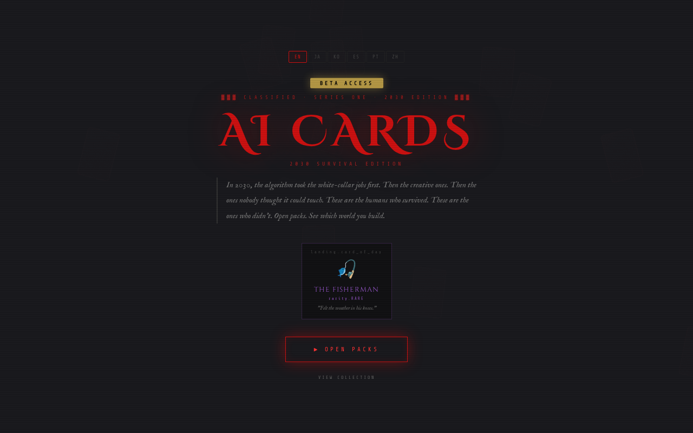

# AI CARDS — 2030 Survival Edition

**A collectible card experience about AI displacement and the humans who survive automation.**

Gacha-style pack opening with 448 cards across 6 rarities and 19 sets. Cards are NFTs on Sui blockchain. Live at **[aicards.fun](https://aicards.fun)**.

## Features

- **448 cards** across 19 thematic sets (Jobless.ai, Doomscroll, Love.exe, War Room, and more)
- **6 rarities**: Mythic (1/10,000), Legendary, Rare, Uncommon, Common, Junk
- **Raid Boss battles**: Hourly rotating bosses, 5-card team selection, turn-based auto-combat
- **Daily missions**: Open packs, pull legendaries, share cards for rewards
- **Progressive unlock**: Each set gates behind the previous set's 100% completion
- **Full i18n**: English, Japanese, Korean, Spanish, Portuguese, Chinese
- **Sui NFTs**: On-chain minting, trading, and collectibility
- **DALL-E 3 art**: 448 unique card illustrations in black & white underground comix style

## Tech Stack

- **Frontend**: Single HTML file (vanilla JS + CSS) — no build step, no framework
- **Contracts**: Sui Move (card NFT, payment treasury, pack minting)
- **Minting API**: FastAPI on Fly.io (`aicards-mint.fly.dev`)
- **Admin**: Next.js dashboard on Fly.io with Postgres + zkLogin auth
- **Hosting**: Vercel (frontend), Fly.io (API + admin)

## Quick Start

Visit [aicards.fun](https://aicards.fun) — no account needed. Open packs, build your collection.

## License

MIT
